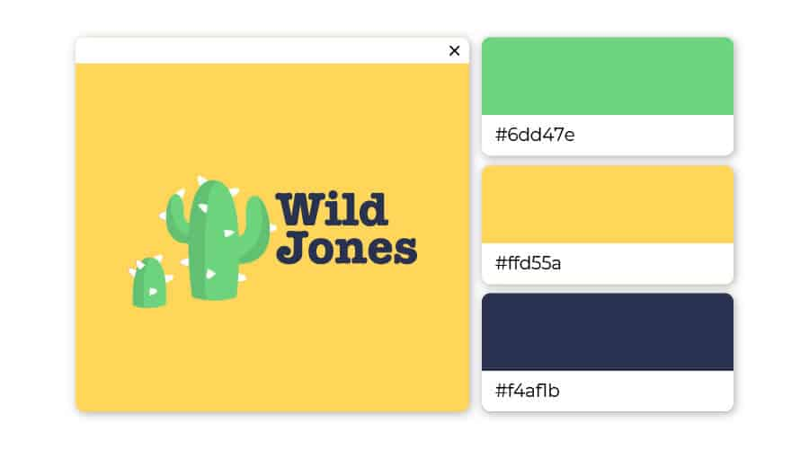

# Charte graphique

palette de couleur :  Bleu, jaune, vert : énergique et intelligent  

  

Cette combinaison comprend deux couleurs primaires avec leur couleur secondaire, une association parfaite !  
Le jaune ocre associé au citron vert confère un sentiment d’énergie et de vivacité,  
alors que le bleu azur apporte une touche de sagesse à l’ensemble.

##  police d'ecriture

police: Lato

titre d article / accroche: Bold 700 
paragraphe : Light 300 

titre des films : Regular 400
synopsis : Light 300